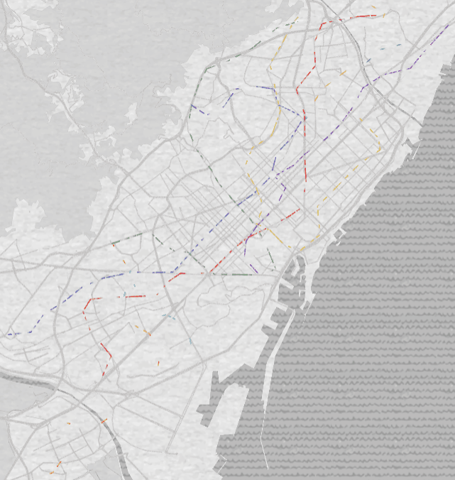
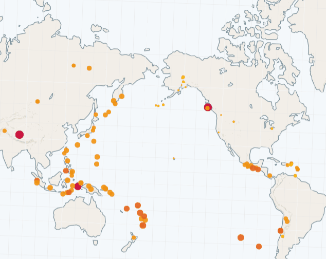

# KeplerGL Project

This project contains various data visualization projects using KeplerGL, a powerful geospatial visualization tool.

## Barcelona Metro Visualization

The metro visualization project processes Barcelona's metro data to create interactive visualizations using KeplerGL.

### Visualitzation

### Data Sources
- The `data/` directory contains raw data obtained from the TMB (Transports Metropolitans de Barcelona) API
- `metro_data.csv` is a processed file generated by `create_dataframe.py` that combines and cleans the raw TMB data

### Data Processing

The project includes two main scripts:

1. `create_dataframe.py`:
   - Processes raw TMB API data
   - Cleans and structures the data
   - Creates a unified `metro_data.csv` file with all necessary information

2. `create_geojson_file.py`:
   - Reads the processed `metro_data.csv`
   - Generates individual GeoJSON files for each metro line
   - These GeoJSON files are then used in KeplerGL for visualization
   - Each file contains the complete route information including:
     - Stop coordinates
     - Trip information
     - Route details
     - Timing data

## Earthquakes Visualization

The earthquakes visualization project provides an interactive map showing earthquake activity worldwide. The visualization includes:

- **Time-based Analysis**: View earthquakes within specific time frames
- **Magnitude Visualization**:
  - Color coding based on earthquake magnitude
  - Size of points proportional to earthquake strength
- **Interactive Features**:
  - Filter by time period
  - View detailed information for each earthquake
  - Track earthquake patterns and clusters

### Visualitzation

